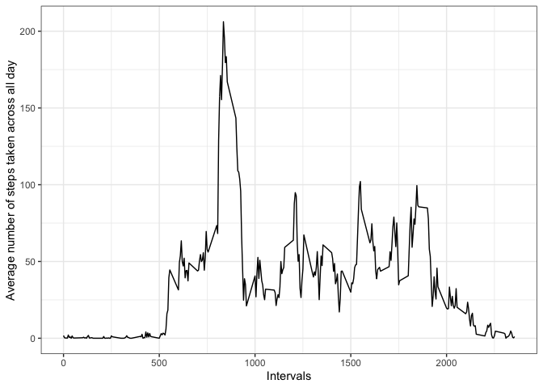
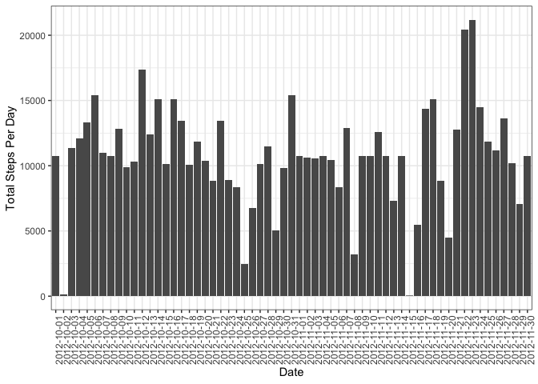
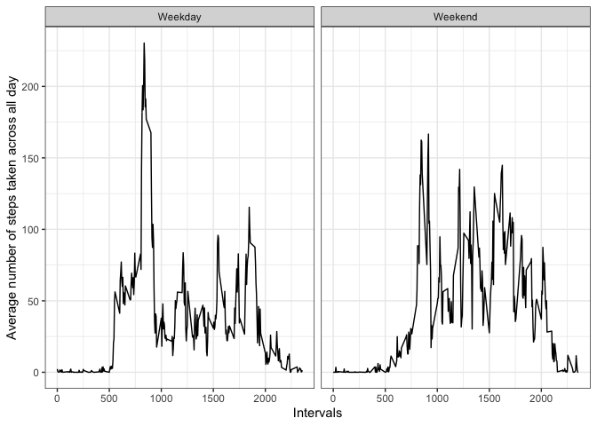

## Loading and preprocessing the data
### Upzip activity.zip 


```r
unzip("activity.zip")
```

```
## Warning in unzip("activity.zip"): error 1 in extracting from zip file
```

### Load and preview data

```r
act <- read.csv("activity.csv")
summary(act)
```

```
##      steps                date          interval     
##  Min.   :  0.00   2012-10-01:  288   Min.   :   0.0  
##  1st Qu.:  0.00   2012-10-02:  288   1st Qu.: 588.8  
##  Median :  0.00   2012-10-03:  288   Median :1177.5  
##  Mean   : 37.38   2012-10-04:  288   Mean   :1177.5  
##  3rd Qu.: 12.00   2012-10-05:  288   3rd Qu.:1766.2  
##  Max.   :806.00   2012-10-06:  288   Max.   :2355.0  
##  NA's   :2304     (Other)   :15840
```

### Convert date into POSIXct class (ymd format)

```r
require(lubridate)
act$date <- ymd(act$date)
str(act)
```

```
## 'data.frame':	17568 obs. of  3 variables:
##  $ steps   : int  NA NA NA NA NA NA NA NA NA NA ...
##  $ date    : Date, format: "2012-10-01" "2012-10-01" ...
##  $ interval: int  0 5 10 15 20 25 30 35 40 45 ...
```

## What is mean total number of steps taken per day?

### Calculate total number of steps taken per day

```r
by_date_total <- data.frame(tapply(act$steps, act$date, sum, na.rm = TRUE))
colnames(by_date_total) <- "total_steps"
by_date_total$Date <- rownames(by_date_total)
```

### Make histogram of the total number of steps taken per day and report mean and median

```r
require(ggplot2)
ggplot(data=by_date_total, aes(x=as.factor(Date), y=total_steps))+
  geom_bar(stat = "identity")+xlab("Date")+ylab("Total Steps Per Day")+
  theme_bw()+theme(axis.text.x = element_text(angle = 90, hjust = 1, size = 9))
```

<!-- -->

### Calculate mean and median

```r
m_step <- mean(by_date_total$total_steps, na.rm = TRUE)
med_step <- median(by_date_total$total_steps, na.rm = TRUE)
```
The mean total number of steps taken per day is 9354.23 steps, and 
the median total number of steps take per day is 10395 steps.

## What is the average daily activity pattern?

### Make a time series plot of the 5-minute interval and the average number of steps taken, averaged across all days

```r
require(dplyr)
daily_act <- act%>%group_by(interval)%>%summarise(mean=mean(steps,na.rm=TRUE))

ggplot(data=daily_act, aes(x=interval, y=mean))+
  geom_line()+xlab("Intervals")+
  ylab("Average number of steps taken across all day")+
  theme_bw()
```

<!-- -->

### Find the 5-minute interval that contains the maximum number of steps

```r
step_max <- daily_act$interval[which.max(daily_act$mean)]
```
The interval 835 contains the maximum number of steps of 206.17

## Imputing missing values

### Calculate the number of NAs in the dataset

```r
numNA <- sum(is.na(act$steps))
```
The number of NAs in the dataset is 2304

### Devise strategy to fill in the missing values in the dataset
The missing values will be replaced with the median of the corresponding 5-min interval.

### Create new dataset with missing values filled in

```r
replace <- daily_act[match(filter(act,is.na(steps))$interval,daily_act$interval),"mean"]
act[is.na(act$steps),"steps"] <- as.vector(replace)
```

### Make histogram of the total number of steps taken per day and report mean and median

```r
by_date <- data.frame(tapply(act$steps, act$date, sum, na.rm = TRUE))
colnames(by_date) <- "total_steps"
by_date$Date <- rownames(by_date)

ggplot(data=by_date, aes(x=as.factor(Date), y=total_steps))+
  geom_bar(stat = "identity")+xlab("Date")+ylab("Total Steps Per Day")+
  theme_bw()+theme(axis.text.x = element_text(angle = 90, hjust = 1, size = 9))
```

<!-- -->

```r
mean_step <- mean(by_date$total_steps, na.rm = TRUE)
median_step <- median(by_date$total_steps, na.rm = TRUE)
```
The mean total number of steps taken per day is 1.076619\times 10^{4} steps, and 
the median total number of steps take per day is 1.0766189\times 10^{4} steps.
Both mean and median increase with the input of missing values.

## Are there differences in activity patterns between weekdays and weekends?

### Make an indicator for whether a given day is weekday or not

```r
act$isWeekDay <- ifelse(weekdays(act$date)=="Sunday" | weekdays(act$date)=="Saturday",
                        "Weekend", "Weekday")
```

### Make a time series plot of the 5-minute interval and the average number of steps taken, averaged across all days, comparing weekday and weekend

```r
week_act <- data.frame(tapply(act$steps, list(act$interval, act$isWeekDay), 
                              mean, na.rm = TRUE))
week_act$Interval <- rownames(week_act)

require(reshape)
```

```
## Loading required package: reshape
```

```
## 
## Attaching package: 'reshape'
```

```
## The following object is masked from 'package:dplyr':
## 
##     rename
```

```
## The following object is masked from 'package:lubridate':
## 
##     stamp
```

```r
act_plot <- melt(week_act)
```

```
## Using Interval as id variables
```

```r
ggplot(data=act_plot, aes(x=as.numeric(Interval), y=value))+
    geom_line()+xlab("Intervals")+
  ylab("Average number of steps taken across all day")+
  theme_bw()+facet_wrap(.~variable)
```

<!-- -->
